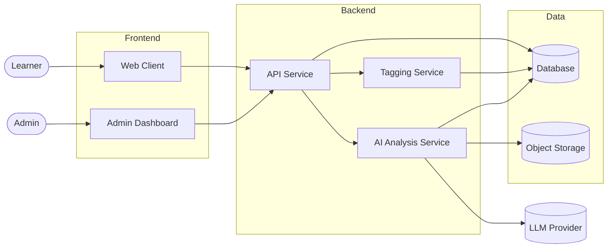
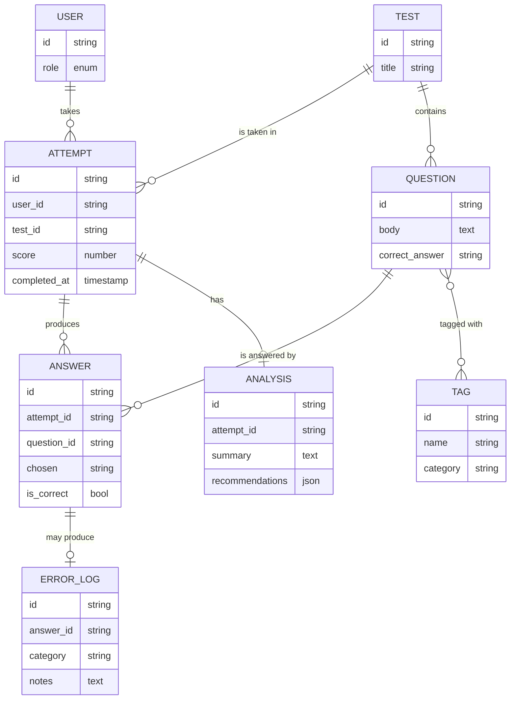
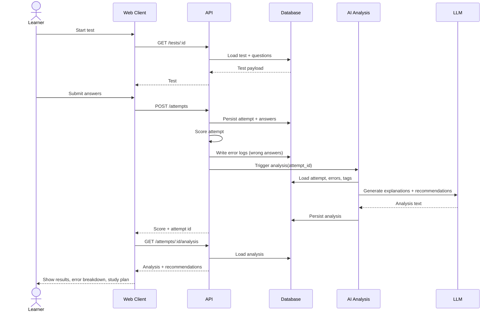
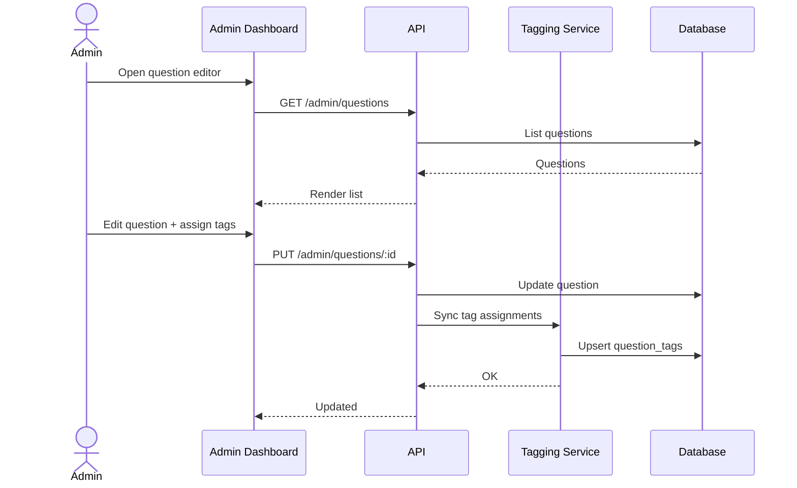

# Architecture

High-level system design for the AI-guided learning platform. This document captures services, data flow, and key application flows.

## Services (logical)

| Service | Responsibility |
|---------|----------------|
| **Web client** | Learner UI — test taking, score view, error analysis, recommendations |
| **Admin dashboard** | Internal UI — manage questions, tags, users, content |
| **API / backend** | Core REST/GraphQL service — auth, attempts, scoring, persistence |
| **Tagging service** | Maintains question tag taxonomy; serves tag-based queries |
| **AI analysis service** | Consumes attempt + error data, produces explanations and recommendations |
| **Database** | Stores users, questions, tags, attempts, answers, error logs |
| **Object storage** | Stores large artifacts (e.g. raw error logs, generated reports) |

## High-level system diagram

## Data model (core entities)

## Application flow — Learner taking a test

## Application flow — Admin managing questions and tags

## Cross-cutting concerns
- **Auth** — role-based (learner vs admin) on all API routes.
- **Async work** — AI analysis runs out of band so submission feels instant; client polls or subscribes for results.
- **Observability** — structured logs and metrics on attempts, AI latency, tagging coverage.
- **Idempotency** — attempt submission and analysis triggers must be idempotent on retry.

## Open architecture questions
- Sync vs async analysis trigger (queue vs direct call).
- Single backend service vs separate AI service from day one.
- Tag taxonomy: free-form tags vs curated controlled vocabulary.
- LLM provider choice and prompt-cache strategy for cost control.
